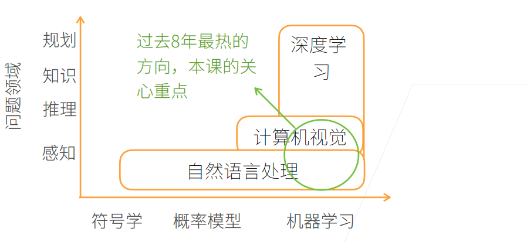

# Day01

## 资源

- 课程主页: https://courses.d2l.ai/zh-v2
- 教材: https://zh-v2.d2l.ai
- 教程论坛: https://discuss.d2l.ai/c/16
- Pytorch论坛: https://discuss.pytorch.org/

## AI 地图



## 图像分类


## 物体检测和分割


## 样式迁移


## 人脸合成


## 文生图


## 文字生成


## 自动驾驶


#  数据操作

## N 维数组样例

- N维数组是机器学习和神经网络的主要数据结构.

  

  

  

  ## 访问元素

  

  ## 代码

- 张量表示创建一个数组, 这个数组可以是多个维度

  ```python
  import torch
  
  x = torch.arange(12)
  ```

  

- 要改变一个张量的形状但是不改变元素数量和元素值,我们可以调用reshape函数

  ```shell
  X = x.reshape(3, 4)
  X
  ```

  

- 通过提供包含数值的Python列表(或嵌套列表)来为所需张量中每个元素赋予确定值.

```shell
torch.tensor([[2, 1, 4, 3], [1, 2, 3, 4], [4, 3, 2,1]])
```


- 使用全0\全1\其他常量或者从特定分布中随机采样的数字.

  

- 常见的标准算术运算符(+\-\* / 和**) 都可以被提升为按元素运算

  

- 我们也可以把多个张量连接在一起concatenate

  

- 通过逻辑运算符构建二元张量

  

- 对张量中的所有元素进行求和会产生一个只有一个元素的张量

  

- 即使形状不同, 我们仍然可以通过调用 **广播机制** 来执行按元素操作

  

- 可以使用[-1]选择最后一个元素, 可以使用[1:3] 选择第二个和第三个元素

  

- 除此之外,我们还可以通过指定索引来将元素写入矩阵

  

- 为多个元素赋值相同的值，我们只需要索引所有元素，然后为它们赋值

  

- 运行一些操作可能会导致为新结果分配内存

  

- 执行原地操作

  

- 如果后续计算中没有重复使用X, 我们也可以使用X[:] = X + Y或 X += Y来减少操作的内存开销

  

- 转换为Numpy张量

  

- 将大小为1的张量转换为python标量

  